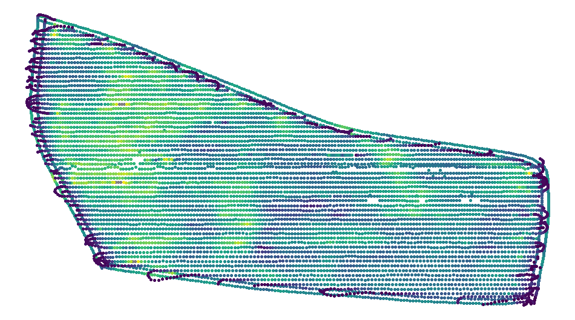

# R_AvgDiff
R-Implemenation of the "Averaged Difference"-Algorithm for Spatial Outlier Detection conceived by Yufeng Kou and Chang-Tien Lu in the scientific paper "Spatial Weighted Outlier Detection"1 from 2006. The algorithm is suitable to detect point observation with distinct features from their surrounding neighbors. 
The algorithm is demonstrated by the means of agricultural yield data and generally suitable especially for the use in context of Precision Farming applications. 

:seedling: iFAROS. This algorithm was implemented in the course of iFAROS project. https://www.ifaros-ictagri.com/  
:bullettrain_side: High Performance. Calculation for ~8000 points (see __Results__) in about 1.5 seconds. 

## Dependencies: 
:wrench: __sp__-package, for geometry types 
:wrench: __data.table__-package, as faster alternative for _base::data.frame_ 
:wrench: __FNN__-package, for k-nearest-neighbor search algorithm 

## Parameters: 
- Input: _SpatialDataPointsDataFrame_, georeferenced point data with attribute-_data.frame_ 
- Input: _k_, number of neighbours taken into account (as in _k-Nearest-Neighbor_) 
- Output: _data.table_, containing index and the corresponding _averaged difference_ in decreasing order 

## Result: 
 
 

## Future Improvements: 
- Implementation of a stand-alone package already unclusing dependencies.  

1 http://citeseerx.ist.psu.edu/viewdoc/download?doi=10.1.1.101.9899&rep=rep1&type=pdf
